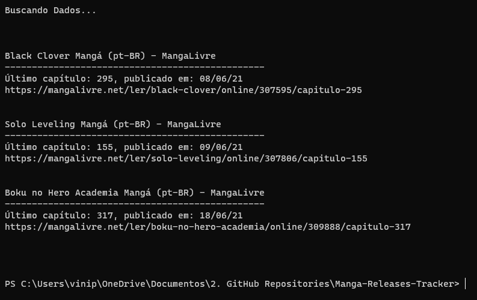

# Script com WebScraping para acompanhar meus mangas favoritos
Para adicionar ou remover mangas basta alterar o dicionário 'mangas'  
Este script utiliza o selenium: `pip install selenium` para buscar meus mangas favoritos no site mangalivre.net e exibir no terminal:
- último cápitulo publicado
- data de publicação
- link para a leitura

