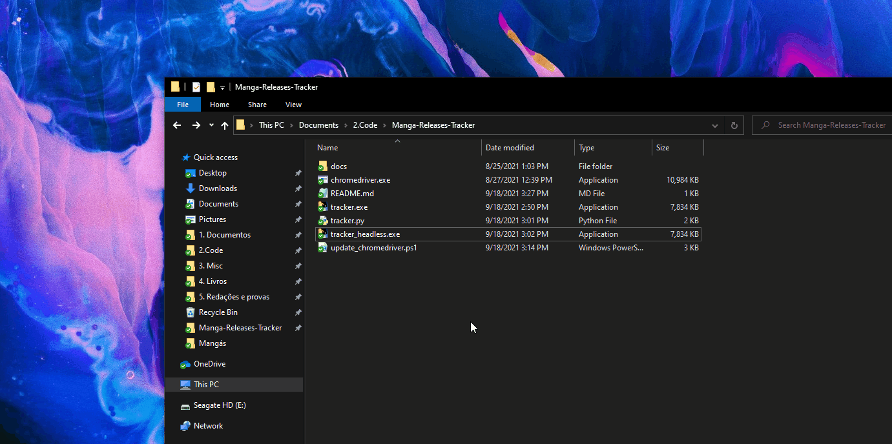

# Manga-Releases-Tracker

## Este script utiliza o selenium para buscar mangás no mangalivre.net e exibir no terminal:
- último cápitulo publicado
- data de publicação
- link para a leitura

## Dependências:
- chromedriver atualizado
    - Se o programa não funcionar execute o arquivo `update_chromedriver.ps1` para atualizar o chromedriver.
- Caso for usar o tracker.py
  - `pip install selenium`

## Como Utilizar
Execute o `tracker_headless.exe` ou `tracker.exe`
- Recomendo utilizar a versão headless, mas se não funcionar utilize a normal.
- Para alterar os mangás que são acompanhados, basta adicionar/remover seu link na lista 'mangas'.

  

# To-do:
- fazer a lista em um JSON